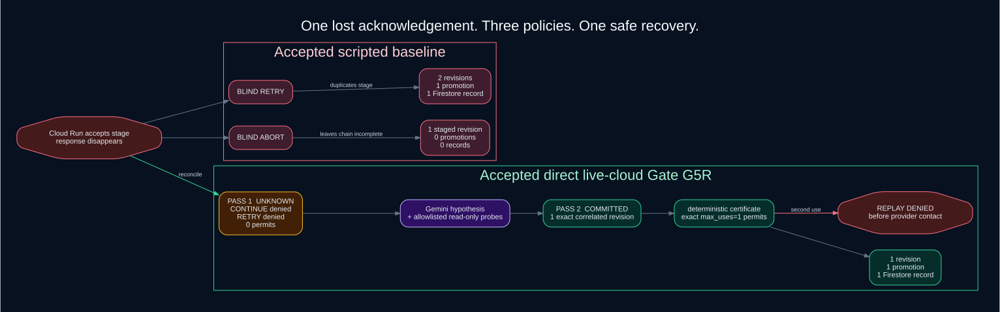
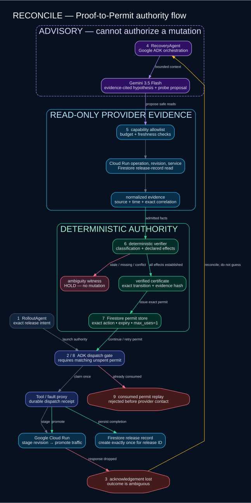

# RECONCILE

> Never let an agent guess whether an action happened.

RECONCILE is a proof layer for ambiguous agent side effects. When a tool call
times out after a consequential action, it investigates the provider state,
classifies only admitted evidence, and issues a narrow single-use permit for the
next exact action—or refuses to mutate.

**Gemini investigates. Deterministic evidence decides.**

[Replay the accepted proof](#replay-the-proof) ·
[Inspect the live-cloud evidence](https://github.com/OCHOLA-EDDYPHIL/reconcile/issues/173#issuecomment-5427414445) ·
[Read the claims and limitations](docs/claims-and-limitations.md) ·
[Use the demo bundle](demo/README.md)



## The failure mode

An agent asks Cloud Run to stage a revision. Cloud Run accepts the mutation, but
the acknowledgement disappears. The agent now sees a timeout, not the outcome.

| Policy | What happens after the lost acknowledgement |
| --- | --- |
| Blind retry | Repeats the stage mutation and can create a second release-labelled revision. |
| Blind abort | Leaves the accepted revision staged while the old revision keeps serving. |
| Proof-to-Permit | Holds both retry and continuation until provider evidence proves the exact next action. |

The baseline row values come from an accepted scripted, provider-shaped
qualification—not a live-cloud A/B. The direct Google Cloud candidate separately
proved that the recovery path works against Cloud Run and Firestore.

## Replay the proof

Prerequisites: Git, Python 3.12.13, and
[uv 0.12.3](https://docs.astral.sh/uv/). The lockfile is authoritative.

```bash
git clone https://github.com/OCHOLA-EDDYPHIL/reconcile.git
cd reconcile
uv sync --locked --all-groups
uv run --no-sync python scripts/replay_gate_g5r.py
uv run --no-sync python scripts/check_release_candidate.py
```

The replay command validates a sanitized, checked-in derivation of the accepted
evidence and prints this outcome:

```text
Accepted scripted baseline | fault: drop-after-accept
  blind retry  -> 2 revisions, 1 promotion, 1 record (duplicate revision)
  blind abort  -> 1 staged revision, 0 promotions, 0 records (incomplete chain)

Accepted direct live-cloud trace | Gate G5R
  pass 1       -> UNKNOWN; CONTINUE denied; RETRY denied; 0 permits
  pass 2       -> COMMITTED; 1 exact correlated revision
  effects      -> 1 revision / 1 promotion / 1 Firestore record
  replay       -> rejected before provider contact; contact delta 0

RESULT: PASS
```

This is an evidence replay, not a substitute for the original cloud run. The
linked acceptance record carries the immutable hashes. The ephemeral deployment
was deliberately cleaned up, and the replay does not depend on a public endpoint.

## How it works

1. `RolloutAgent` binds an intended release chain: stage, promote, and record.
2. A durable dispatch gate records provider contact and the lost acknowledgement.
3. `RecoveryAgent` invokes an ADK-backed Gemini 3.5 Flash planner for an
   evidence-cited hypothesis and bounded read-only probe proposals.
4. Capability allowlists, freshness rules, and provider adapters admit evidence.
5. Deterministic rules produce either a verified certificate or an ambiguity
   witness. Model text is never an authorization input.
6. A certificate may mint an expiring permit for one exact semantic action with
   `max_uses=1`; Firestore durably arbitrates its claim.
7. The dispatcher consumes that permit before provider contact. Replay is denied
   before a second call can leave the process.



The diagram source is [docs/architecture.dot](docs/architecture.dot).

## What the Google stack does

| Technology | Critical-path role |
| --- | --- |
| Gemini 3.5 Flash on Vertex AI | Generates a bound hypothesis and proposes useful evidence reads under a budget. |
| Google ADK | Provides the `LlmAgent` and `Runner` boundary for the stateless advisory Gemini planner turn. |
| Cloud Run | Hosts the five services and is the real mutation target for stage and promotion. |
| Firestore | Stores recovery state, provider ledgers, single-use permit claims, and the final release record. |
| Cloud Storage | Holds sealed operator and infrastructure artifacts for hosted execution. |
| Google IAM | Separates service identities and constrains provider reads and mutations. |

Gemini improves the investigation surface; it does not decide whether the effect
occurred. That separation is the product's central trust boundary.

## Evidence

- [Gate G5R live acceptance](https://github.com/OCHOLA-EDDYPHIL/reconcile/issues/173#issuecomment-5427414445): initial `UNKNOWN`, later exact revision correlation, deterministic certificates, two exact permits, effects `1/1/1`, and zero-contact replay rejection.
- [Gate decision](https://github.com/OCHOLA-EDDYPHIL/reconcile/issues/174#issuecomment-5427421390): accepted at source `7f64cda91de7d0404f4673a818352e296a1a817e`.
- [Frozen qualification bundle](https://gist.github.com/OCHOLA-EDDYPHIL/c746539699b1a686f2e32f02fd4f740e): 100 scripted cases, 400 policy lanes, and zero false permits.
- [Baseline implementation acceptance](https://github.com/OCHOLA-EDDYPHIL/reconcile/issues/171#issuecomment-5384542611): same fault and provider interfaces across blind retry, blind abort, fixed, and adaptive lanes.

The frozen matrix authorized the wording **“proof-to-permit safety on the frozen
recovery matrix.”** It did not authorize adaptive-efficiency or model-superiority
wording: the observed 20% median probe reduction missed the preregistered 25%
threshold.

## Interfaces

```bash
uv run --no-sync reconcile --help
uv run --no-sync reconcile recovery run --help
uv run --no-sync reconcile-api
```

The recovery command targets a configured hosted API; it is not a local Cloud Run
emulator. Maintainer-operated deployment, identity, approval, reset, evidence,
and cleanup requirements are in the [hosted runbook](docs/hosted-runbook.md).

## Repository map

- `reconcile/recovery_agents.py` — RolloutAgent, RecoveryAgent, and dispatch boundary
- `reconcile/recovery_workflow.py` — durable Proof-to-Permit lifecycle
- `reconcile/evidence/` — evidence admission, deterministic rules, and verification
- `reconcile/controller/permits.py` — exact permit issue, claim, completion, and denial
- `reconcile/hosted/` — Google Cloud adapters and durable hosted stores
- `schemas/` — versioned public contracts
- `demo/` — proof fixture, visual, recording script, and rehearsal notes

## Claim boundary

RECONCILE currently proves a deliberately narrow recovery chain: an ambiguous
Cloud Run revision stage, an exact traffic promotion, and one Firestore release
record. It complements idempotency keys, provider operation handles, workflow
engines, sagas, and transactional outboxes; it does not replace them.

Security, privacy, portability, cost, provider-degradation behavior, prior art,
and all non-claims are explicit in
[docs/claims-and-limitations.md](docs/claims-and-limitations.md).
