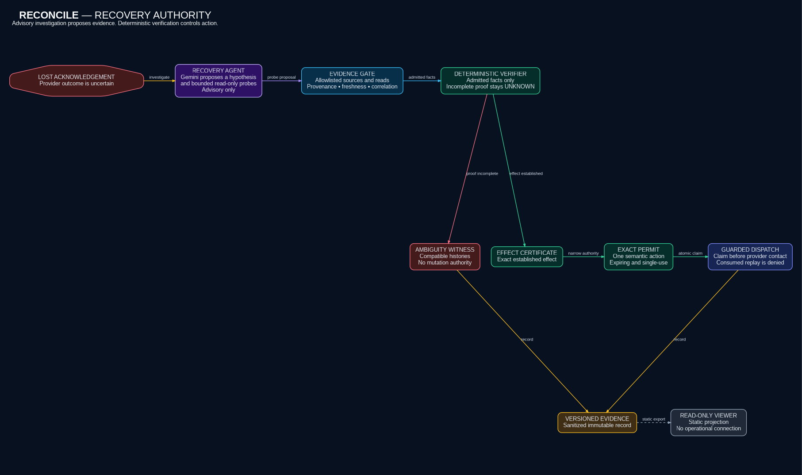
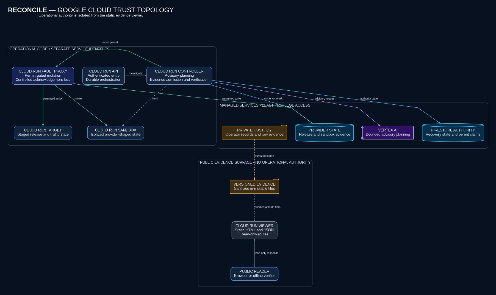

# RECONCILE

> Never let an agent guess whether an action happened.

RECONCILE is an evidence-bound recovery layer for ambiguous agent side effects.

When a consequential tool call times out, RECONCILE reads provider state,
admits only correlated evidence, and issues a narrow single-use permit for the
next exact action—or refuses to mutate.

**Gemini investigates. Deterministic evidence decides.**

[Validate the offline evidence bundle](#validate-the-offline-evidence-bundle) ·
[Inspect the provider evidence record](evidence/v0.1.0/provider-proof.json) ·
[Read the claims and limitations](docs/claims-and-limitations.md) ·
[Inspect the versioned evidence](evidence/v0.1.0/proof-to-permit.json)

## The failure mode

An agent asks Cloud Run to stage a revision. Cloud Run accepts the mutation, but
the acknowledgement disappears. The agent sees a timeout, not the outcome.

| Policy | Result after the lost acknowledgement |
| --- | --- |
| Blind retry | Repeats the stage mutation and can create a duplicate revision. |
| Blind abort | Leaves the accepted revision staged while the previous revision keeps serving. |
| Evidence-bound recovery | Holds retry and continuation until admitted provider evidence authorizes one exact action. |

The recovery protocol is called **Proof-to-Permit**. Its scripted baseline and
recorded Google Cloud run are separate evidence layers: the baseline compares
policies under one controlled fault, while the provider record demonstrates the
hosted recovery path.

## Validate the offline evidence bundle

Prerequisites: Git, Python 3.12.13, and
[uv 0.12.3](https://docs.astral.sh/uv/). The lockfile is authoritative.

```bash
git clone https://github.com/OCHOLA-EDDYPHIL/reconcile.git
cd reconcile
uv sync --locked --all-groups
uv run --no-sync python scripts/validate_evidence.py
uv run --no-sync python scripts/check_public_package.py
```

The first command performs offline evidence validation. It checks the frozen
classifications, counts, hashes, permit constraints, replay result, and cleanup
inventory in the checked-in evidence bundle. It does not rerun the recovery
workflow, invoke Gemini, or contact Google Cloud. It does not depend on a public
endpoint.

The validated summary is:

```text
Accepted scripted baseline | fault: drop-after-accept
  blind retry  -> 2 revisions, 1 promotion, 1 record (duplicate revision)
  blind abort  -> 1 staged revision, 0 promotions, 0 records (incomplete chain)

Recorded direct live-cloud evidence
  pass 1       -> UNKNOWN; CONTINUE denied; RETRY denied; 0 recovery-action permits
  pass 2       -> COMMITTED; 1 exact correlated revision
  authority    -> hash-bound deterministic certificates; two max_uses=1 permits
  evidence     -> 49 durable events; provider projection hash linked
  effects      -> 1 revision / 1 promotion / 1 Firestore record
  replay       -> rejected before provider contact; contact delta 0
  cleanup      -> zero retained cloud resources

RESULT: PASS
```

This result validates recorded, sanitized evidence. It is not a provider run.

## Recovery path

1. [`RolloutAgent`](reconcile/recovery_agents.py) binds an intended release chain:
   stage, promote, and record.
2. A durable dispatch gate records provider contact and the lost acknowledgement.
3. [`RecoveryAgent`](reconcile/recovery_agents.py) uses an ADK-backed Gemini 3.5
   Flash planner for an evidence-cited hypothesis and bounded read-only probes.
4. [Evidence admission](reconcile/evidence/admission.py) applies capability,
   freshness, provenance, and correlation rules to provider observations.
5. [Deterministic verification](reconcile/evidence/recovery_verification.py)
   produces a hash-bound verified certificate or an ambiguity witness. Model
   text is never an authorization input.
6. The [recovery workflow](reconcile/recovery_workflow.py) may issue an expiring
   permit for one exact semantic action with `max_uses=1`.
7. The [Firestore permit store](reconcile/hosted/firestore_permits.py) claims that
   permit before the [dispatcher](reconcile/hosted/recovery_dispatch.py) contacts
   the provider. Replay is denied before another call can leave the process.

The effect graph is a declared action DAG populated and verified against
admitted provider observations; Gemini does not infer or authorize that graph.

[](docs/architecture.png)

[Architecture diagram source](docs/architecture.dot)

## Hosted deployment boundary

The hosted path separates public entry, recovery control, provider mutation, and
durable authority state across narrowly scoped services and identities.

[](docs/deployment.png)

[Deployment diagram source](docs/deployment.dot)

| Technology | Critical-path role |
| --- | --- |
| Gemini 3.5 Flash on Vertex AI | Forms a bound hypothesis and proposes useful evidence reads under a budget. |
| Google ADK | Provides the stateless advisory planner boundary. |
| Cloud Run | Hosts API, controller, fault proxy, sandbox, and canary services. |
| Firestore | Separates runtime authority, sandbox state, and release records. |
| Cloud Storage | Holds sealed operator and infrastructure artifacts. |
| Google IAM | Gives each service only the authority needed for its role. |

Gemini improves the investigation surface; it does not decide whether an effect
occurred. That separation is the central trust boundary.

## Evidence

The [v0.1.0 evidence release](https://github.com/OCHOLA-EDDYPHIL/reconcile/releases/tag/v0.1.0)
publishes the provider evidence record, corroboration, cleanup record, and
checksums together.

| Evidence layer | Purpose |
| --- | --- |
| [Provider evidence record](evidence/v0.1.0/provider-proof.json) | Records initial `UNKNOWN`, later exact revision correlation, hash-bound deterministic certificates, two exact permits, effects `1/1/1`, stable snapshot reread, and zero-contact replay rejection. |
| [Live corroboration](evidence/v0.1.0/live-corroboration.json) | Records revision-bound Cloud Run services, isolated Firestore databases, correlated logs, and the durable event snapshot reread. |
| [Cleanup verification](evidence/v0.1.0/cleanup-verification.json) | Records the post-capture zero-resource inventory. |
| [Evidence bundle manifest](evidence/v0.1.0/proof-to-permit.json) | Hash-links the scripted qualification and provider records for offline validation. |

The scripted qualification covers 100 cases, 400 policy lanes, and zero false
recovery-action permits. It did not authorize adaptive-efficiency or
model-superiority claims: the observed 20% median probe reduction missed the
preregistered 25% threshold. The exact authorized wording is recorded in the
[claims and limitations](docs/claims-and-limitations.md).

## Static evidence viewer

The viewer exports a closed, immutable bundle from one validated versioned
evidence directory. It records the viewer source revision separately from the
source revision described by the evidence, embeds no environment identity, and
runs under a role-free identity with no outbound application calls to the
operational API or provider targets.

```bash
PUBLIC_EVIDENCE=/absolute/path/outside-repo/public-evidence/v0.1.1
VIEWER_BUNDLE=/absolute/path/outside-repo/viewer-bundle
VIEWER_CONTEXT=/absolute/path/outside-repo/viewer-context

uv run --no-sync python -m viewer.export \
  --evidence "$PUBLIC_EVIDENCE" \
  --output "$VIEWER_BUNDLE" \
  --build-context-output "$VIEWER_CONTEXT"

VIEWER_SOURCE_REVISION="$(uv run --no-sync python -c \
  'import json,sys; print(json.load(open(sys.argv[1], encoding="utf-8"))["viewer_source_revision"])' \
  "$VIEWER_BUNDLE/snapshot.json")"
EVIDENCE_SOURCE_REVISION="$(uv run --no-sync python -c \
  'import json,sys; print(json.load(open(sys.argv[1], encoding="utf-8"))["evidence_source_revision"])' \
  "$VIEWER_BUNDLE/snapshot.json")"
SNAPSHOT_SHA256="$(sha256sum "$VIEWER_BUNDLE/snapshot.json" | awk '{print $1}')"

docker build \
  --file "$VIEWER_CONTEXT/Dockerfile" \
  --build-arg VIEWER_SOURCE_REVISION="$VIEWER_SOURCE_REVISION" \
  --build-arg EVIDENCE_SOURCE_REVISION="$EVIDENCE_SOURCE_REVISION" \
  --build-arg SNAPSHOT_SHA256="$SNAPSHOT_SHA256" \
  --tag reconcile-viewer:"$VIEWER_SOURCE_REVISION" \
  "$VIEWER_CONTEXT"
```

The exporter refuses a dirty checkout, a non-`main` branch, or a local `main`
that differs from `origin/main`; the runtime sources are read from that verified
commit. The runtime serves only the generated HTML, snapshot, bundle manifest,
and health response over `GET` and `HEAD`. Other methods are rejected. The
complete digest-pinned Cloud Run deployment sequence is in the
[hosted runbook](docs/hosted-runbook.md#static-viewer-boundary).

## Interfaces

```bash
uv run --no-sync reconcile --help
uv run --no-sync reconcile recovery run --help
uv run --no-sync reconcile-api
```

The recovery command targets a configured hosted API; it is not a local Cloud Run
emulator. Maintainer-operated deployment, identity, approval, reset, evidence,
and cleanup requirements are in the [hosted runbook](docs/hosted-runbook.md).

## Repository map

- [`reconcile/recovery_agents.py`](reconcile/recovery_agents.py) — rollout,
  recovery, and dispatch boundaries
- [`reconcile/recovery_workflow.py`](reconcile/recovery_workflow.py) — recovery
  state machine and exact action permits
- [`reconcile/evidence/`](reconcile/evidence/) — admission, deterministic rules,
  and verification
- [`reconcile/controller/permits.py`](reconcile/controller/permits.py) — permit
  issue, claim, completion, and denial
- [`reconcile/hosted/`](reconcile/hosted/) — Google Cloud adapters and durable
  stores
- [`schemas/`](schemas/) — versioned public contracts
- [`evidence/`](evidence/) — immutable, versioned public evidence bundles
- [`viewer/`](viewer/) — static evidence projection and read-only server

## Claim boundary

RECONCILE covers a deliberately narrow chain: an ambiguous Cloud Run revision
stage, an exact traffic promotion, and one Firestore release record. It
complements idempotency keys, provider operation handles, workflow engines,
sagas, and transactional outboxes; it does not replace them.

Security, privacy, portability, cost, provider-degradation behavior, prior art,
and non-claims are explicit in
[docs/claims-and-limitations.md](docs/claims-and-limitations.md).
